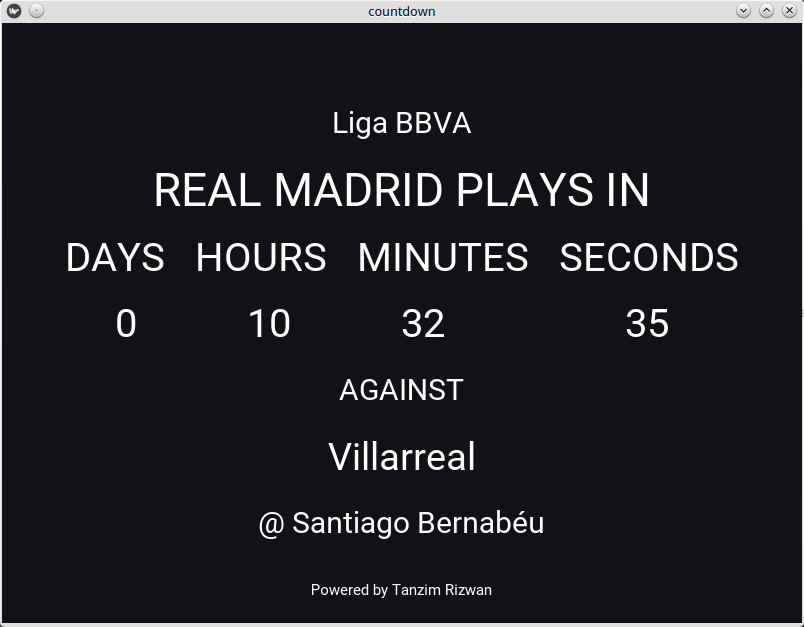

Real Madrid Countdown
======

## Getting Started

This is a python2 script with kivy gui which creates a countdown of Real Madrid's upcoming match and also shows some relevent informations. 

### Prerequisities
install requests
```
pip install requests
```
install Beautifulsoup
```
pip install beautifulsoup4
```


install kivy
```
$ sudo add-apt-repository ppa:kivy-team/kivy
$ sudo apt-get update
$ sudo apt-get install python-kivy
```
## Version 
* Version 0.1

##Test
run main.py
```
python main.py
```
 

## Contact Me
* e-mail: tanzimrizwan@gmail.com
