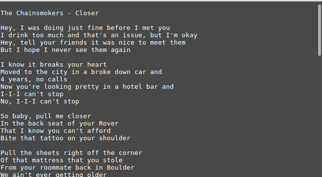

# Spotify_Lyrics
Downloads from [musixmatch](www.musixmatch.com) and displays lyrics to currently playing song in the Spotify desktop client in the Linux Terminal.


# running from source
If you want to run from source you need:

* Python 2.7 (probably any version of Python 2)
* pip install -r requirements.txt
* Open Terminal 
* Type python and the location of the spotify_lyrics.py file
    ```python home/username/spotify_lyrics.py ```
* Now press Enter and see the magic!!!


# screenshot
Tested in linux mint 18




# Contact me
* email: tanzimrizwan@gmail.com
